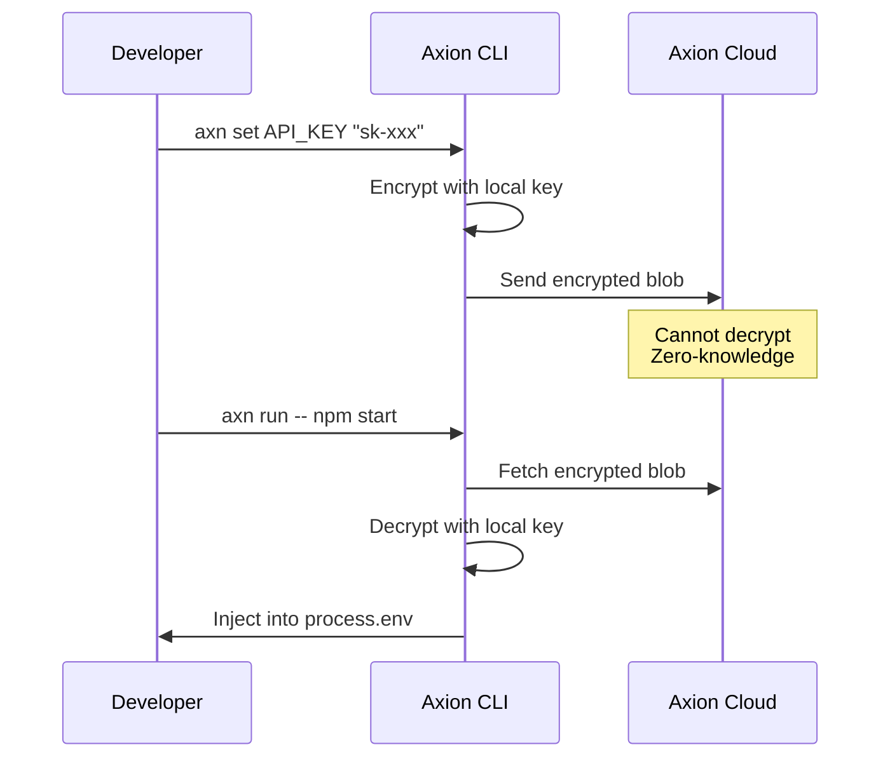

# Security

Axion employs a **client-side zero-knowledge architecture** with industry-standard cryptography.

## Encryption

| Component | Implementation |
|:----------|:---------------|
| **Encryption** | AES-256-GCM (authenticated encryption) |
| **Key Derivation** | Argon2id (64 MiB memory, 3 iterations, 4 parallelism) |
| **Project Key** | 128-bit random key |
| **Salt** | 256-bit random salt per encryption |
| **IV** | 128-bit random IV per encryption |
| **Format** | Versioned for future algorithm upgrades |

## How It Works



## Key Management (Zero-Disk Auth)

Axion uses a **Zero-Disk Authentication** model for enhanced security.

-   **Development**: Keys are fetched dynamically from the server when you run `dotset login`.
-   **Memory-Only**: Keys are injected directly into process memory and never written to disk.
-   **Scope Isolation**: Each environment (Development, Staging, Production) has a unique encryption key.

<Note>
Legacy local-only projects may still use `.dotset/axion/key` for offline development, but cloud-linked projects use dynamic key fetching.
</Note>

<Warning>
This file contains your encryption key. Add it to `.gitignore` and back it up securely.
</Warning>

## Protected Keys

Configure write-only secrets in `axion.config.yaml`:

```yaml
protected_keys:
  - STRIPE_SECRET_KEY
  - DATABASE_PASSWORD
```

Protected keys:
- Can be set but not revealed
- Cannot be exported
- Cannot be viewed with `--reveal`

## Validation Patterns

Enforce secret formats:

```yaml
validation:
  DATABASE_URL: "^postgres://"
  API_KEY: "^sk-[a-z0-9]{32}$"
```

## Key Rotation

Rotate your encryption key:

```bash
axn rotate
```

This:
1. Generates a new key
2. Re-encrypts all secrets
3. Invalidates the old key

## Key Recovery

Set up recovery before you need it:

```bash
# Create recovery blob
axn recovery setup

# Restore if key is lost
axn recovery restore
```

## Audit Logs

Track all activity across your project with a tamper-proof audit trail (Pro/Business).

### Unified Audit System

dotset provides a unified audit log that captures events across all products:

| Source | Events Logged |
|:-------|:--------------|
| **Axion** | Secret reads, writes, deletions, key rotations |
| **Gluon** | Security mode changes, leak detections, blocks |
| **Hadron** | CI job executions, secret injections |
| **Platform** | Team changes, token management, project settings |

### Hash Chain Integrity

Every audit log entry is linked to the previous entry via a SHA-256 hash chain. This makes the audit trail **tamper-evident** — any modification breaks the chain.

```bash
# Verify audit log integrity
dotset audit verify
```

```
✓ Verified 1,247 audit entries
✓ Hash chain intact
✓ No tampering detected
```

### Viewing Logs

```bash
# View recent audit logs
dotset audit

# Filter by action type
dotset audit --action secret.read

# Filter by user
dotset audit --user dev@example.com

# Filter by scope
dotset audit --scope production

# Filter by date range
dotset audit --since 2024-01-01 --until 2024-01-31

# Filter by source product
dotset audit --source axion
```

### Log Entry Contents

Each audit entry includes:

- **Action** — What happened (e.g., `axion.secret.read`, `platform.member.add`)
- **Actor** — User email or service token name
- **Scope** — Environment scope (development/staging/production)
- **IP Address** — Origin of the request
- **Timestamp** — When the action occurred
- **Metadata** — Additional context (secret key name, affected user, etc.)
- **Hash** — SHA-256 link to previous entry

### Exporting Logs

Export audit logs for compliance reporting:

```bash
# Export as JSON
dotset audit export --format json --output audit-2024.json

# Export as CSV
dotset audit export --format csv --output audit-2024.csv

# Export specific date range
dotset audit export --since 2024-01-01 --until 2024-03-31 --format json
```

<Tip>
Exported logs include the hash chain, allowing offline integrity verification.
</Tip>

### Dashboard Access

View and filter audit logs in the dashboard:

1. Navigate to your project
2. Click the **Audit** tab
3. Use filters to narrow results by action, user, scope, or date

<Note>
Audit log retention varies by plan: Free (7 days), Pro (90 days), Business (1 year).
</Note>

## Best Practices

<CardGroup cols={2}>
  <Card title="Gitignore" icon="git">
    Add `.dotset/axion/key` to `.gitignore`
  </Card>
  <Card title="Backup" icon="cloud">
    Back up your key to a password manager
  </Card>
  <Card title="Rotate" icon="rotate">
    Rotate keys periodically or after team changes
  </Card>
  <Card title="Protect" icon="lock">
    Mark sensitive keys as protected
  </Card>
</CardGroup>

