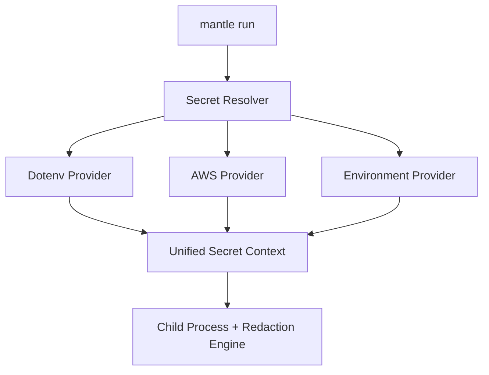

# Secret Providers

Mantle is **provider-agnostic**. It doesn't force you to migrate your secrets to a specific format or platform. Instead, it aggregates secrets from the places they already live.

## The Resolver Pattern

When you run `mantle run`, Mantle uses a **Secret Resolver** to collect data from a list of configured providers.



## Supported Providers

### 1. Dotenv (`dotenv`)
Automatically detects `.env`, `.env.local`, `.env.development`, and `.env.production`. This enables zero-migration setup for most web projects.

### 2. AWS Secrets Manager (`aws-sm`)
Pulls secrets directly from AWS using the AWS SDK. This is ideal for production environments where secrets are managed at the infrastructure layer.

### 3. Environment (`environment`)
Captures existing shell environment variables. By default, it looks for variables prefixed with common patterns like `API_`, `SECRET_`, `TOKEN_`, etc.

## Provider Priority

Providers are evaluated in the order they are defined. If multiple providers define the same secret key, the **last one wins**.

- **Auto Mode**: By default (`--providers auto`), Mantle evaluates providers in this order: `dotenv` -> `environment` -> `aws-sm`.
- **Manual Mode**: You can override this using the `--providers` flag.

```bash
# Prioritize AWS secrets over local .env files
mantle run --providers dotenv,aws-sm -- npm start
```

## Streaming Redaction Engine

Regardless of the source, once secrets are resolved, they are automatically tracked by Mantle's **Streaming Redaction Engine**. 

Unlike simple regex scanners, this engine uses a **line-buffered approach**. This ensures that even if a secret is split across two network packets (chunks) in your CI output, Mantle will pause, buffer, and redact correctly before the data is flushed to your logs.
