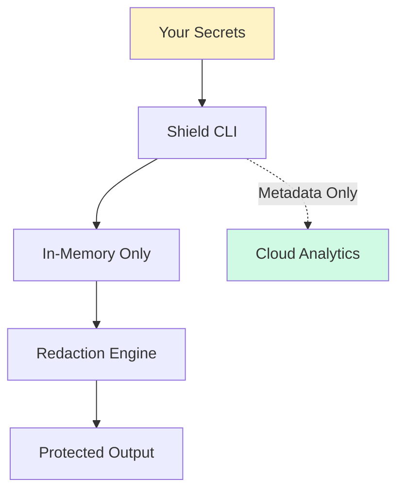

# Trust & Transparency

We understand that feeding your secrets through any tool requires trust. This page explains exactly what Shield does with your data — and what it doesn't.

## Your Secrets Never Leave Your Machine

<Warning>
**TL;DR**: Secret values are processed entirely locally. We never see, store, or transmit your actual secrets.
</Warning>

Here's exactly what happens when you run `dotset run`:



1. **Secrets are read** from your providers (`.env`, AWS SM, environment variables)
2. **Values are held in-memory** during command execution only
3. **Output streams are scanned** for these values and redacted
4. **After exit**, secret values are garbage collected — never written to disk

### What is NOT Sent to Our Servers

| Data | Sent? | Reason |
|------|-------|--------|
| Secret values | ❌ Never | Processed locally only |
| Secret names/keys | ❌ Never | Not needed for analytics |
| Build log contents | ❌ Never | Redaction happens locally |
| Source code | ❌ Never | We never access your code |
| `.env` file contents | ❌ Never | Read locally, never transmitted |

---

## What Telemetry IS Sent

When you use `dotset link` to enable cloud analytics, we send **only metadata**:

| Field | Example | Purpose |
|-------|---------|---------|
| `secretCount` | `5` | Track how many secrets you're protecting |
| `exposureCount` | `2` | Measure redaction effectiveness |
| `exposures` | `[{patternName: "ENV:API_KEY", count: 1}]` | Pattern names only (not values) |
| `providers` | `["dotenv", "environment"]` | Understand provider usage |
| `mode` | `"redact"` | Track protection mode adoption |
| `duration` | `1234` | Performance monitoring |
| `command` | `"npm start"` | General usage patterns |
| `exitCode` | `0` | Track command success |

<Tip>
You can verify this yourself by reading [telemetry.ts on GitHub](https://github.com/dotsetlabs/shield/blob/main/src/telemetry.ts#L34).
</Tip>

---

## Offline-First Design

Shield is designed to work **100% offline**. Cloud features are completely optional:

| Feature | Requires Cloud? |
|---------|-----------------|
| Secret redaction | ❌ No |
| `.env` file loading | ❌ No |
| Protection modes (detect/redact/block) | ❌ No |
| HTML report generation | ❌ No |
| Local CI runner | ❌ No |
| Protection analytics | ✅ Yes (opt-in) |
| Custom security policies | ✅ Yes (opt-in) |
| Email/Slack alerts | ✅ Yes (opt-in) |

### Disabling All Cloud Features

```bash
# Run with no telemetry sent
dotset run --no-telemetry -- npm start
```

Or never link your project — Shield works without any account.

---

## Open Source & Auditable

The entire Shield CLI is **open source** under the MIT license. You can:

<CardGroup cols={2}>
  <Card title="View Source Code" icon="github" href="https://github.com/dotsetlabs/shield">
    Full source on GitHub
  </Card>
  <Card title="Audit Telemetry" icon="magnifying-glass" href="https://github.com/dotsetlabs/shield/blob/main/src/telemetry.ts">
    See exactly what data is sent
  </Card>
  <Card title="Build From Source" icon="hammer">
    Clone and build locally instead of using npm
  </Card>
  <Card title="Report Issues" icon="bug" href="https://github.com/dotsetlabs/shield/issues">
    Security issues welcome via responsible disclosure
  </Card>
</CardGroup>

---

## Verify It Yourself

Don't trust us? **Good.** Here's how to verify our claims:

### 1. Read the Code

The telemetry module is ~150 lines. All server communication goes through `reportProtectionEvent()`:

```typescript
// From src/telemetry.ts - this is ALL that's sent
export interface ProtectionEventData {
    runId: string;
    command: string;
    mode: 'detect' | 'redact' | 'block';
    providers: string[];
    secretCount: number;        // Just the count
    exposureCount: number;      // Just the count
    exposures: ExposureDetail[]; // Pattern names only
    duration: number;
    exitCode: number;
    timestamp: string;
}
```

No secret values. No secret names. Just counts and metadata.

### 2. Monitor Network Traffic

Run with `--no-telemetry` and watch for network activity:

```bash
# No network requests will be made
dotset run --no-telemetry -- npm start
```

### 3. Build From Source

```bash
git clone https://github.com/dotsetlabs/shield
cd shield
npm install
npm run build
npm link

# Now use your locally-built version
dotset run -- npm start
```

---

## Security Contact

Found a security issue? We take security seriously.

**Email**: [hello@dotsetlabs.com](mailto:hello@dotsetlabs.com)

We follow responsible disclosure practices and will work with you to address any vulnerabilities.
