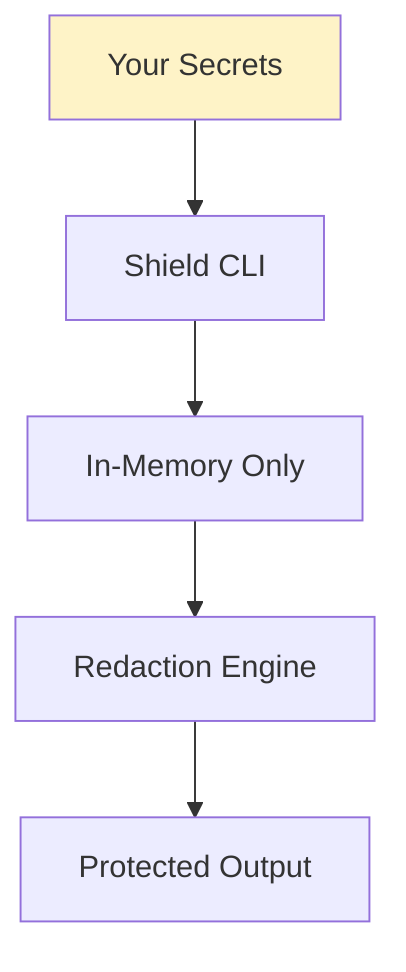

# Trust & Transparency

We understand that feeding your secrets through any tool requires trust. This page explains exactly what Shield does with your data.

## Your Secrets Never Leave Your Machine

<Warning>
**TL;DR**: Secret values are processed entirely locally. Shield never transmits your actual secrets anywhere.
</Warning>

Here's exactly what happens when you run `dotset shield run`:



1. **Secrets are read** from your providers (`.env`, AWS SM, environment variables)
2. **Values are held in-memory** during command execution only
3. **Output streams are scanned** for these values and redacted
4. **After exit**, secret values are garbage collected — never written to disk

### What is NOT Collected

| Data | Collected? | Reason |
|------|---------|--------|
| Secret values | ❌ Never | Processed locally only |
| Secret names/keys | ❌ Never | Not needed |
| Build log contents | ❌ Never | Redaction happens locally |
| Source code | ❌ Never | We never access your code |
| `.env` file contents | ❌ Never | Read locally, never transmitted |

---

## 100% Local Operation

Shield is designed to work **100% locally**. No cloud connection is required:

| Feature | Works Offline? |
|---------|----------------|
| Secret redaction | ✅ Yes |
| `.env` file loading | ✅ Yes |
| Protection modes (detect/redact/block) | ✅ Yes |
| HTML report generation | ✅ Yes |
| All CLI features | ✅ Yes |

---

## Open Source & Auditable

The entire Shield CLI is **open source** under the MIT license. You can:

<CardGroup cols={2}>
  <Card title="View Source Code" icon="github" href="https://github.com/dotsetlabs/cli">
    Full source on GitHub
  </Card>
  <Card title="Build From Source" icon="hammer">
    Clone and build locally instead of using npm
  </Card>
  <Card title="Report Issues" icon="bug" href="https://github.com/dotsetlabs/cli/issues">
    Security issues welcome via responsible disclosure
  </Card>
</CardGroup>

---

## Verify It Yourself

Don't trust us? **Good.** Here's how to verify our claims:

### 1. Read the Code

The entire CLI is open source. Check any file you want:

```bash
git clone https://github.com/dotsetlabs/cli
# Read any file — there's nothing hidden
```

### 2. Build From Source

```bash
git clone https://github.com/dotsetlabs/cli
cd shield
npm install
npm run build
npm link

# Now use your locally-built version
dotset shield run -- npm start
```

---

## Security Contact

Found a security issue? We take security seriously.

**Email**: [hello@dotsetlabs.com](mailto:hello@dotsetlabs.com)

We follow responsible disclosure practices and will work with you to address any vulnerabilities.
